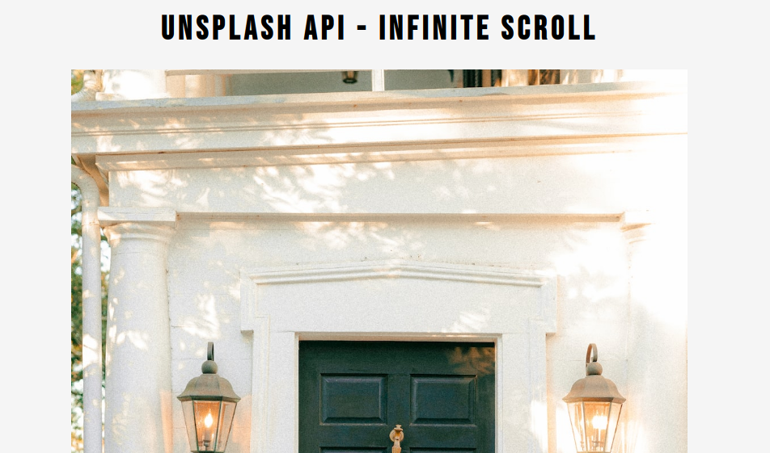

# Infinite Scroll -> [LIVE DEMO](https://shcoobz.github.io/infinite-scroll/)

## Summary

Infinite Scroll is a web application that leverages the Unsplash API to fetch and display an endless stream of random images. It's designed to provide users with a seamless and continuous visual experience, showcasing the vast and beautiful collection of photos from Unsplash.

The core functionality includes:

- Automatic loading of new images as the user scrolls, providing an infinite stream of content.
- A responsive design that ensures an optimal viewing experience across different devices.

## Features

### Infinite Scrolling

The application automatically fetches and displays new images from Unsplash as the user scrolls down, creating an endless scrolling experience.

### Responsive Design

Infinite Scroll adapts to various screen sizes to ensure that users have a great viewing experience, whether they're on a desktop, tablet, or smartphone.

### Unsplash Integration

Leverages the Unsplash API to source a wide variety of high-quality and diverse images, offering users fresh content to explore with every scroll.

### Additional Features

- Simple and intuitive user interface for easy navigation and viewing.
- Optimized loading for better performance and user experience.

## Technologies

- HTML/CSS: For structuring and styling the web interface.
- JavaScript: Implements the logic for fetching images from the Unsplash API and managing the infinite scroll functionality.
- Unsplash API: Provides access to a vast library of high-resolution images.

---

_Note: This document provides an overview of Infinite Scroll. For detailed instructions and more information, please refer to the source code documentation._
